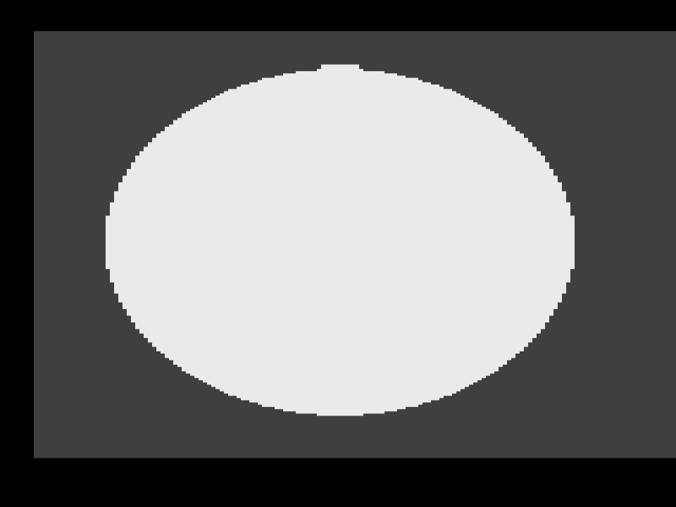
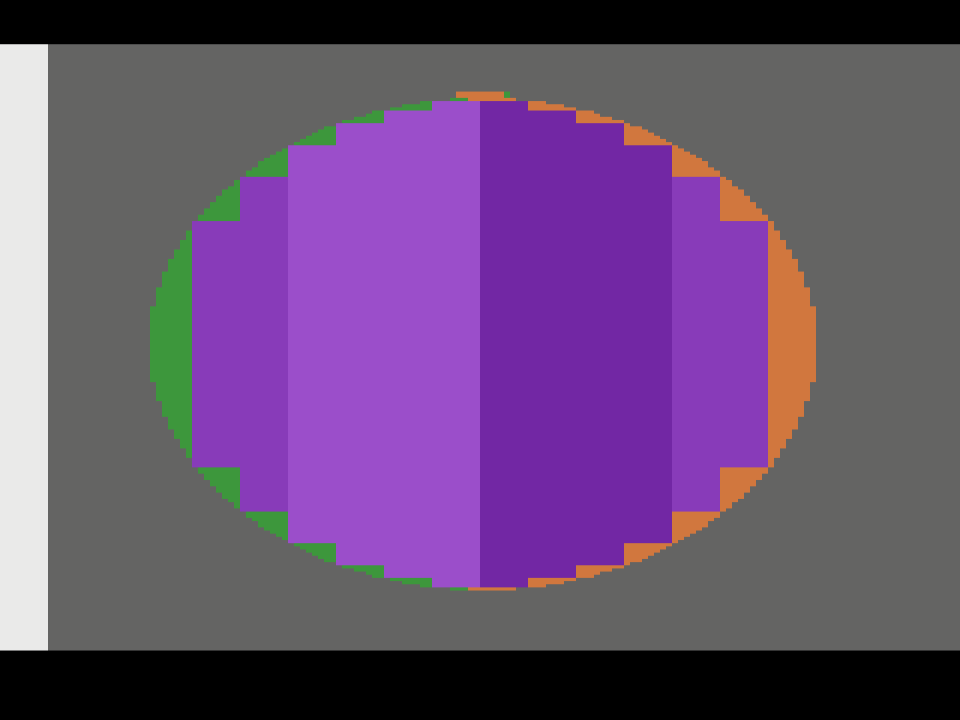
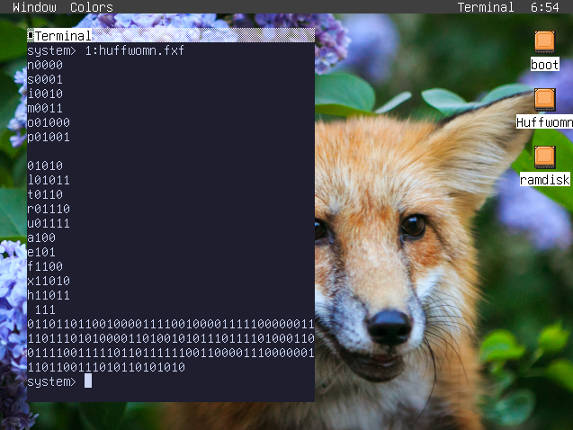
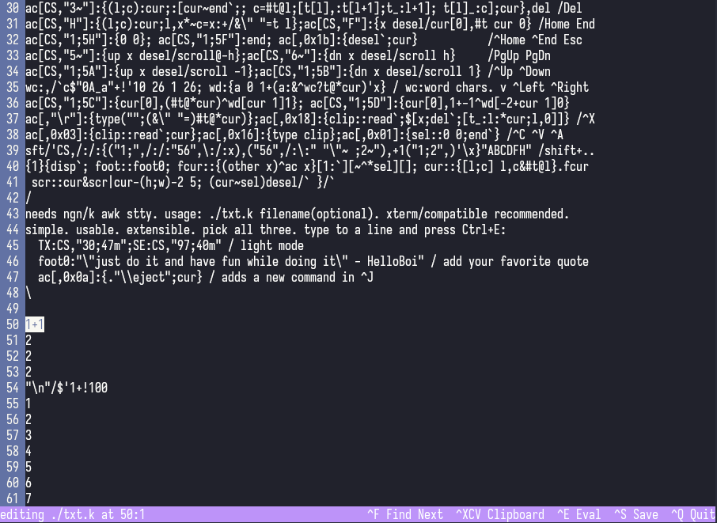
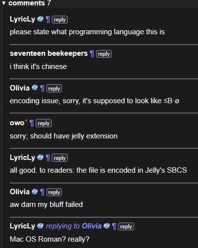
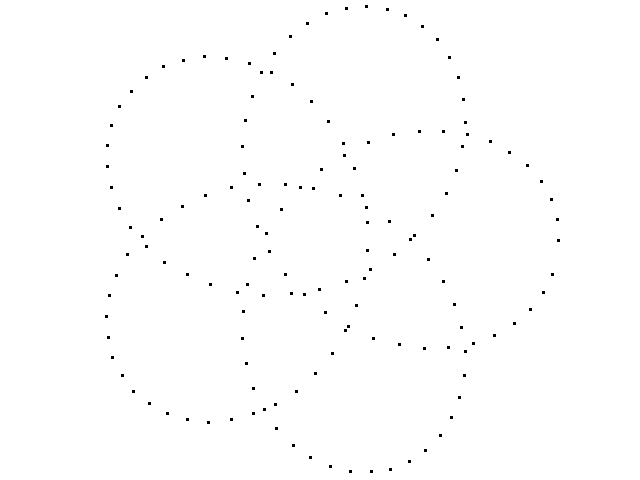

[Code guessing](https://codeguessing.gay/info/) is a competition where the participants code and then guess who wrote the code. Of course this kind of pushes you to go out of your comfort zone and try out something you haven't used before and I find that quite fun! And for some reason they keep not guessing me

# Every code guessing submission I have written. ever
This is like an archive of everything I've written with some of my notes. All the files are in this repository or you may read along in <https://codeguessing.gay/stats/taswelll>.

## round #77 (circle)

[Link.](https://codeguessing.gay/77/#9)

I, like many of my guessmates interpreted the challenge as "draw a circle". I had a bit of time so I thought about [Atari 2600](https://en.wikipedia.org/wiki/Atari_2600) as a notoriously hard console to draw things on.

This submission draws a circle. It does nothing else. None of the controller inputs do anything. You may not move the circle. You may not resize the circle. You may not change the colors of the circle. Just stare at it.



It's more of an ellipse. I tried to correct for the pixel grid being stretched out but it seems I didn't do it right. It also has a bit bulging out the top like an onion. None of those are technical limitations I just didn't bother fixing them.

In 2600 you have to prepare each scan line while the previous one is being drawn, and the processor is pretty slow so this limits you quite a bit. Thankfully all I'm doing is draw a circle which isn't too bad. Though you can't just tell it "please at x=20 light up for 49 clock cycles". We have to get three friends involved: M0, M1, and PF.



I decided I wanted my circle to be as high resolution as feasible so I wanted to use a method that would allow precise pixel positioning. You have to talk to the [chip](https://archive.org/details/Atari_2600_TIA_Technical_Manual) in the console about "objects" to draw in the screen. I used two of these, M0 ("missile 0", shown in green) and M1 ("missile 1", shown in orange). 

Precise pixel positioning of objects is a little bit of an art, you have to write to a register when the beam is in the right position and tweak it afterwards. Thankfully we only have to do that once, to put them both in the center, and then move them horizontally by a few pixels every frame. I didn't think it would just let you move it to the other side of the screen. It does. Yay!

We can fill the inside using another feature, the PF ("playfield", shown in purple), a sort of low resolution background. The playfield has to be symmetric so it's actually important that the circle is in the center (I don't think I did this pixel perfectly but it looks fine).

That's two lookup tables in the ROM, one for the small movements of the missiles and one for the size of the playfield. I filled these by [drawing a circle in GIMP](https://www.wikihow.com/Draw-a-Circle-in-Gimp) and manually counting pixels and filling it up with squares. Of course it's slightly wrong. But you can't tell!

resources used: [Stella Programmers Guide](https://www.alienbill.com/2600/101/docs/stella.html), [2600 101](https://www.alienbill.com/2600/101/)

## round #74 (send a song in discord)

[Link.](https://codeguessing.gay/74/#1)

Featuring swedish lofi musician weatherday

Requires discord.py lol nobody expected me to just use python

## round #71 (huffman code)
[Link.](https://codeguessing.gay/71/#3)

Compress a message using a [Huffman code](https://en.wikipedia.org/wiki/Huffman_coding). I used the canonical method with the priority queue. I did so in [fox32](https://github.com/fox32-arch), world's best fox-themed instruction set and graphical operating system. I didn't use any of the graphical stuff I just made it use the fox32 terminal for output.

Watch it encode "this is an example of a huffman tree" (the tree in the wikipedia article isn't the same, but the length of the encodings of the letters is, that's what actually matters):



Here is a file called "action plan" that I found in the folder where I was doing everything:
```
challenge: Huffman encoding of a string.
We assume the string is ascii (0x01-0x7F) <- N=127 characters.

input: command line? file?

occurences:
    get an array a of zeros N*32bits
    for each character, a[c]+=1
init priority queue:
    for each character, put it in the priority queue if a[c] != 0.
    idea:  lower 8 bits for character (bit 7 is always 0)
           higher 24 or 32 bits for precedence (so we can just compare the whole)
           so we just occurence<<8 | char
    read items from the right, push to the right
    length of queue in a register
create huffman tree:
    pop two lowest items, push one with the sum of the precedence and references
        to each character (we don't need the occurences afterwards, just the tree)
    idea: use a negative character, or one that has bit 7 set, for the combined nodes.
        which is then an index into the _same_ array yet again
    each iteration will decrease the length of the queue by one and increase the
        non-leaf nodes by one: so just put combine the two things we popped out into the
        end of the list.
    because it's two bytes we could store each in the lower bytes, or in 16-bit halves
canonical huffman tree:
    technically unnecessary. though we very probably should get another buffer for this.
    (or use the higher 32 bits that we have been leaving empty)
    either way we need to convert it to some representation that's nice for encoding, and
    the most obvious option is to store the encoding for c in a[c] in some way.
    (probably length and then bytes)
encoding:
    encode either to actual bits (annoying bit ops) or to directy output 1s and 0s
    note that we need to keep the original buffer around
```

It's kind of confusing because I wanted to do the encoding all in a single 128 word array. It kind of works out except for the end. I had to implement a [binary heap](https://en.wikipedia.org/wiki/Binary_heap) from scratch which was kind of fun.

You have to assemble the source with [fox32asm](https://github.com/fox32-arch/fox32asm/tree/665eaa98fad7fadc5cc9311a25ae85f2cae04274) and get the file into a disk using [ryfs](https://github.com/ry755/ryfs/tree/master) and run it with the [fox32 emulator](https://github.com/fox32-arch/fox32/tree/5d047492ca2fabab1f16f35977e6199b877b0884) with [fox32os](https://github.com/fox32-arch/fox32os/tree/d11a8314bf5349846896e6b16a9e261daccbb309) and [fox32rom](https://github.com/fox32-arch/fox32rom/tree/0911a258754edb015728450aebcd60d85e700db7). The script puts in the disk a `huffwomn.fxf` that reads from the `input.txt` file. I don't know if it will break in newer versions so just in case I put the commit id in all those links.

## round #70 (finish this game)

[Link.](https://codeguessing.gay/70/#7)

One of many boring js submissions but it does say to "upload the scripts you used to finish the game with no further changes". I think it's roughly optimal without using multiplexing

## round #62 (implement a text editor)

[Link.](https://codeguessing.gay/62/#12)

Behold txt.k world's best bad text editor. The code is beautiful and it supports all the keybinds you already expect. It has text selection and indenting support and saving (it closes and opens the file again) and Ctrl+F (which is really just "find next"). It uses an awful awk hack to make it run in raw mode.

`simple. usable. extensible. pick all three.` With Ctrl+E it can run arbitrary code. this is a Feature, actually. Here are some examples of things you can do,
```
  TX:CS,"30;47m";SE:CS,"97;40m"
    / light mode
  foot0:"\"just do it and have fun while doing it\" - HelloBoi"
    / add your favorite quote
  ac[,0x0a]:{."\\eject";cur}
    / adds a new command in ^J
```
It can also work as a little REPL. You want the numbers from 1 to 100 split into lines, you just write `"\n"/$'1+!100` and then Ctrl+E! For things you would do with macros in other editors you can just write functions.



It is written in [ngn/k](https://codeberg.org/ngn/k), an open source implementation of [K](https://en.wikipedia.org/wiki/K_(programming_language)). The lack of real closures was less annoying than I expected. The awful error messages were more annoying than I expected. The bytecode limit was more annoying than I expected (there's a few functions there that are needlessly split up for that reason. though I guess it makes it more extensible)

The clipboard is not the system clipboard it's just a variable called `clip`. It also has no undo or autosave. It also assumes everything is ASCII sorry

## round #59 (interpret probablistic PricK)

[Link.](https://codeguessing.gay/59/#8)

This one is written in [SWI-Prolog](https://www.swi-prolog.org/). It was also my first time using Prolog. Yippee! It's actually a sensible choice this time. I just implemented the language and then did one single [`bagof`](https://www.swi-prolog.org/pldoc/doc_for?object=bagof/3) and it suddenly goes through all the possible code paths.

You can also just join things with operators it's kind of cool. I ended up using `A+M/O` for state (A=stack, M=memory, O=odds / inverse probability)

I also had to implement my own memory because there didn't seem to be anything exactly like what I wanted in Prolog. It's a strange binary tree (see definition of `g`et/`s`et)

## round #56 (reverse-engineer a regex)

[Link.](https://codeguessing.gay/56/#10)

this one is in Forth, [Gforth](https://net2o.de/gforth/) in specific. It's not quite standard, it uses `rdrop` and `third` and `->here` and `-rot` but those can't be too hard to redefine.

I think it's cute. It writes the string written so far in the dictionary which works pretty well, we just have to move the `here` pointer when we need to backtrack.

Feel free to uppercase all the code yourself

## round #54 (implement 3d rendering)

[Link.](https://codeguessing.gay/54/#3)

I did it! It renders a wire-frame of an orthographic projection of a little Minecraft stair and also an octahedron. It's also not too hard to add custom shapes.

[Try it online!](https://rabbits.srht.site/uxn5/#r=U6APf4AIN6AP1oAKN6APsoAMN4AAgAARoAKlgAExoAEjgJA3oAAAJoAqN4AoN4DAgC4XgJYWgAEcBoABHiAAG4AAECAAFYABMCEhIbSgAAApIAAEIoI8GoAAEYCSNoAgP2AAzwAvJoAfP6AAASQ5JiU6b4gMESUkYAAFLzpvOmwFgAAEJzoCD4AHIDqAAE84bCag_m2ggACvOCRvOCsgAAegBkg4QP_pJqABkoQWYyogAAygAyQ5YP_poP__OmymgB8_OjkmYP-xgAE_pmD_qqAAKGD_pDmgAQAkOWygAZI5YP-obCZg__QvYP-fL6TvZGD_YiTvYP9dOG9vJS8lYP9UL2D_UG8kOW9sLyegAbtg_0OCBic8OSUlOG-AED85bC-AATC0LyEhFIAAiyAAG29gABvvJC9gAD1vYAARgQkYM2ABBgFA_-EiYmJslIAAgFA_BKAAIDkkIZYME2wkL2D_Zm9g_4iAJDaAAT84L4AigQcIb2wCrREDGQsAgAAAAoICAAKAAoMMgwGAGQABgwIEAQEAAQKDAoYwAAGDAgEBAYUKAQIAgCYAAoAvgBcAAIESAACBLAQBAAABAYESgAWAU4BUAQEBgFiABYEXgWuAToQighCDKIBqHC8kL2QkJ2RnJzlnee8nOAKAgAsgAA6g__86JSRvgAZtL2VkgIKAVBPvpoAfPzo5JzmADz8DIAAWoAQiNW-AfjMjb28lLySAJIAxE0AACIBtM2-AazNjgGcyJoAfP6AAASQ5JoAxMzomgFUzgBA_gE0yOYBNM6sgAEFvJyeCgCo3gCg3gEKALheANzKgAAGDXSgRoAAAOIAjMoAeMjmAED9AAAaAFjKAED-gBCS0JTgkNS8hQP-7YiIibA) You can move the mouse left and right to change the view.


It is implemented in the [Uxntal](https://wiki.xxiivv.com/site/uxntal.html) programming language for the [Varvara](https://wiki.xxiivv.com/site/varvara.html) computer. It runs on [uxn](https://wiki.xxiivv.com/site/uxn.html), a cute little 16-bit stack machine. It's simple enough for it to get embedded into the web.

This also means it's slightly more of a pain to implement certain things. I was using Q7.8 fixed point and the lack of overflow checking or 32 bit multiplication really hurts I don't think it's right at all. I then did cos from a few terms of the Taylor series and then did some dubious math and somehow it worked out

The very first bit that I wrote is the [Bresenham line algorithm](https://en.wikipedia.org/wiki/Bresenham%27s_line_algorithm) implementation and it looks so awful. I was juggling way too many values in the stack. There's a specific angle where the line disappears completely

## round #53 (parse a box drawing)

[Link.](https://codeguessing.gay/53/#2)

I am weirdly proud of this one. Unlike most of my submissions this one is well commented. It's written in [J](https://www.jsoftware.com/) my behated array language. It isn't that bad actually. I thought this challenge was well suited to an array language: the box detection is, the pathfinding isn't (although the `while.` loop isn't that bad)

## round #52 (generate the thue-morse sequence)

[Link.](https://codeguessing.gay/52/#10)

As first uploaded this four-byte file was automatically detected as Big5 reading `氫彃` ("hydrogen shoot"). Of course, in reality it's `ḶB§Ḃ` ("lowered range, binary, sum each, bit") in the [Jelly codepage](https://github.com/DennisMitchell/jellylanguage/wiki/Atoms).



How did "owo" know?

## round #51 (do the impossible)
[Link.](https://codeguessing.gay/51/#3)

The impossible is "calculate the length of a string".

This one features length calculations in 24 programming languages, with Statistical Analysis on top. Indeed! Mean, standard deviation, median, mode, all the goods. It's not just 24 random languages, just some I thought guessers would like.

Most of them say the number of bytes or unicode codepoints, but [JS](https://developer.mozilla.org/en-US/docs/Web/JavaScript/Reference/Global_Objects/String/length) does UTF-16, [Elixir](https://hexdocs.pm/elixir/1.12/String.html#length/1) checks for graphemes, and there's also a dumb brainfuck implementation that lets the result overflow. Oh and PHP spins up a server to curl to and then returns the HTTP_CONTENT_LENGTH header. A shell script `run` and a `shell.nix` glue the whole thing together and you can see all the languages getting called. Try giving it strange or invalid encodings. Much fun to be had.

I should've had something that checks actual length, like rendering the text and measuring how many ems it takes up

All the math is in bash and dc. I didn't notice until deep in the guessing stage that the standard deviation was rounding the results so I sent a patch and it actually got fixed I'm not sure if that's happened very often

## round #50 (implement autocomplete)
[Link.](https://codeguessing.gay/50/#1)

markov.k is an updated version of a file that I had lying around. It's a pretty straightforward [Markov chain](https://en.wikipedia.org/wiki/Markov_chain) using [ngn/k](https://codeberg.org/ngn/k) dictionaries. It's also two lines long

## round #49 (implement a lisp)
[Link.](https://codeguessing.gay/49/#3)

I'm a little surprised I was the only one that did this

## round #45 (play connect four)
[Link.](https://codeguessing.gay/42/#1)

This entry is written in [Dyalog APL](https://dyalog.com/). It has a bunch of stuff on top and then at the very end:
`{⎕←⍞⊢?7⋄∇0}0` meaning "wait for input and then print a random number from 1 to 7". No one seemed to notice it.

The rest of the submission is my unfinished approach to implement a game solving algorithm based on Victor Allis [*A Knowledge-based Approach of Connect-Four*](https://rmarcus.info/blog/assets/conn4/thesis.pdf) (1988). There they make a bot called VICTOR that can always(!) win if playing first. I think this was exciting in the 80's.

By spotting certain patterns in the grid you can identify threats or forced wins which can then be used with some search algorithm. The patterns are things that are fun to implement in array languages like "two vertical empty squares where the above is an odd column" (see "claimeven", "baseeven", "oddthreat"). There are also graph adjacency matrices involved and restrictions on how the rules can interact and things like that.

I still want to finish it! There's a few rules that I didn't implement and also the whole game tree search thing is completely wrong (I tried to figure out some minimax with alpha-beta pruning but it was way too late). I still think it's a cool idea.

## round #43 (emulate a spirograph)
[Link.](https://codeguessing.gay/43/#4)

Behold the worst spirograph ever. Written in [X7](https://github.com/LyricLy/x7/tree/legacy) (the Python version). It's super slow and it only draws a few points because I couldn't be bothered to run it for longer, I think it deep copies the stack for every other instruction or something? And I'm keeping a lot of numbers in there. 

It's all held together with a shell script, it first patches the interpreter (one instruction is broken), and then mashes the argument into the source file (X7 has no input) and then converts the output from the [PBM](https://netpbm.sourceforge.net/doc/pbm.html) format into a black and white image for you to stare at.



It has the sine and cosine in the first line (using a Taylor series, if I recall correctly) and then the rest in the second. I think it just calculates what the point would be for evenly spaced angles? I don't care to reverse engineer the math too much. But it works!

## round #42 (implement 2048)
[Link.](https://codeguessing.gay/42/#1)

Pretty small, pretty straight-forward. It implements 2048 in [Dyalog APL](https://dyalog.com/). I like the `⍉∘⌽⍣⍵` trick to make the cells fall down in each direction. I'll have you know that the whole `>/∘⌽¨(,\` bit is a direct translation of `` <` `` in BQN. I probably could've figured out something better.

## round #41 (implement FALSE)
[Link.](https://codeguessing.gay/41/#10)

Why not write a weird stack language interpreter in an even weirder stack language? I came across ktye's ["j stack language"](https://ktye.github.io/j.html) in [the zoo](https://ktye.github.io/zoo/index.html#jstack) and I had to do it. It's a strange little thing written in a [stranger little thing](https://github.com/ktye/w/) that compiles to WebAssembly. It even has something to interact with JS canvas but I didn't use it. I had to take it out of its natural habitat and write a wrapper around [wasmtime](https://wasmtime.dev/) to use it in the console (I didn't have to do this) and then a nix flake to get the source (I didn't have to do this).

All of that may distract you from [false.jstack](41/false.jstack) which is where the source actually lives. I don't remember how it works. 
Hopefully this file I found in the scene of the crime can elucidate it somewhat

```
[0 n] positive
[1 n..] quotation
[2 n] symbol (a-z: variable)
[3 n..] print to stdout


code
stack
stack pointer
...


at the start of the program we have ( input code -- ... )

init: 

0pquot|__}q[[]],0"",","",,,",,27{do
```
Ok not really. A little. Up there is the format for elements. j stack has quotations that are really just arrays that you can run. I wrote "positive" because negative numbers don't work.
I did provide a file called `txt.txt`:
Maybe check `txt.txt`?
```
write
    'input  <- program input
    '1 1+   <- code
    run

[[in] [out] [a] [b] ... [z] [0] [1] [2] ...] <ptr>
```
The line at the end explains how it actually stores everything. It's a long quotation where the first element is the input, the second is the output, then the 26 variables you have, then the stack. After that there's a top of stack pointer because you can't pop from lists so it just decrements that instead.

In the source, lines 8-12 construct the table that it gets the instructions from. `0"""",,,,"",,",` is the shortest way to get a list of 30 zeroes. `pquot` does parsing, `do` executes, `run` sets up the stack and then executes, I think `w` is a while loop of sorts? `oo` is just dup2.

I think the implementation is feature complete. Well of course there's no interactive IO and j stack's integers are 31 bit. It's mostly feature complete, I ran a few programs with it.

## round #39 (implement brain-flak)
[Link.](https://codeguessing.gay/39/#11)

I found a [parser combinator](https://en.wikipedia.org/wiki/Parser_combinator) library written in [Nix language](https://nix.dev/tutorials/nix-language.html) called [nix-parsec](https://github.com/kanwren/nix-parsec/) and I found it funny, why not, we will make an interpreter in a build system. I also used an [obscure let syntax](https://nixos.wiki/wiki/Nix_Language_Quirks#Old_let_syntax) for no reason. There's not really anything special here other than probably my first time using parser combinators. Maybe I like it better without all the strange Haskell symbols? I haven't decided.

## round #37 (compute digital roots)
[Link.](https://codeguessing.gay/37/#11)

It's the obvious solution but written in [jq](https://jqlang.org/) for style. Was tragic to find out it's a relatively normal language